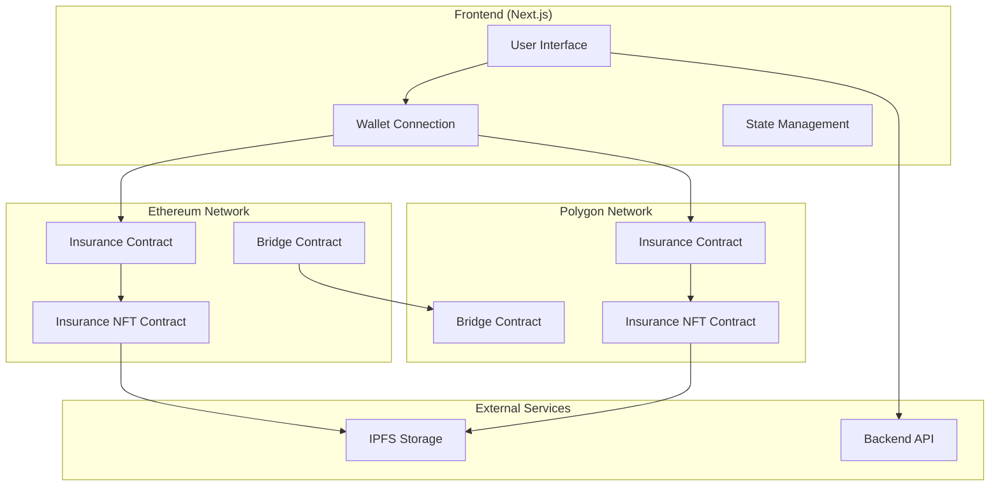

# Design Document

## Overview

The Cross-Chain Insurance NFT system is a decentralized application built on Next.js that enables users to purchase insurance policies as NFTs on Ethereum and claim them by bridging to Polygon. The system leverages existing wallet infrastructure (RainbowKit + Wagmi) and implements smart contracts for policy management and cross-chain transfers.

## Architecture

### High-Level Architecture



### Component Architecture

The application follows a modular architecture with clear separation of concerns:

- **Presentation Layer**: React components for UI
- **Business Logic Layer**: Custom hooks and services
- **Data Layer**: Smart contract interactions and IPFS storage
- **Infrastructure Layer**: Wallet connections and network management

## Components and Interfaces

### Smart Contracts

#### InsuranceNFT Contract (ERC-721)

```solidity
interface IInsuranceNFT {
    struct PolicyData {
        uint256 coverageAmount;
        uint256 premium;
        uint256 startDate;
        uint256 endDate;
        string policyType;
        bool isClaimed;
        string metadataURI;
    }
    
    function mintPolicy(address to, PolicyData memory policy) external returns (uint256);
    function claimPolicy(uint256 tokenId) external;
    function getPolicyData(uint256 tokenId) external view returns (PolicyData memory);
    function bridgeToPolygon(uint256 tokenId) external;
}
```

#### InsuranceMarketplace Contract

```solidity
interface IInsuranceMarketplace {
    struct InsuranceProduct {
        string name;
        string description;
        uint256 coverageAmount;
        uint256 premium;
        uint256 duration;
        bool isActive;
    }
    
    function createProduct(InsuranceProduct memory product) external;
    function purchaseInsurance(uint256 productId, bytes32 policyHash) external payable;
    function getProducts() external view returns (InsuranceProduct[] memory);
}
```

#### CrossChainBridge Contract

```solidity
interface ICrossChainBridge {
    function bridgeNFT(uint256 tokenId, address targetContract, uint256 targetChain) external;
    function receiveNFT(uint256 tokenId, address originalContract, bytes memory data) external;
    function verifyBridge(uint256 tokenId, bytes32 proof) external view returns (bool);
}
```

### Frontend Components

#### Core Components

- `InsuranceMarketplace`: Main marketplace interface
- `PolicyDashboard`: User's policy management
- `ClaimInterface`: Insurance claim submission
- `WalletManager`: Multi-chain wallet management
- `PolicyCard`: Individual policy display
- `BridgeStatus`: Cross-chain transfer tracking

#### Hooks and Services

- `useInsuranceContract`: Smart contract interactions
- `useCrossChainBridge`: Bridge operations
- `useIPFSStorage`: Metadata storage
- `useMultiChain`: Network switching and management
- `usePolicyData`: Policy data management

### Data Models

#### Policy Interface

```typescript
interface Policy {
  id: string;
  tokenId: number;
  owner: string;
  coverageAmount: bigint;
  premium: bigint;
  startDate: Date;
  endDate: Date;
  policyType: string;
  isClaimed: boolean;
  isActive: boolean;
  metadataURI: string;
  network: 'ethereum' | 'polygon';
}
```

#### Insurance Product Interface

```typescript
interface InsuranceProduct {
  id: string;
  name: string;
  description: string;
  coverageAmount: bigint;
  premium: bigint;
  duration: number; // in days
  category: string;
  isActive: boolean;
  terms: string[];
}
```

#### Claim Interface

```typescript
interface Claim {
  id: string;
  policyId: string;
  claimant: string;
  amount: bigint;
  description: string;
  evidence: string[];
  status: 'pending' | 'approved' | 'rejected' | 'completed';
  submittedAt: Date;
  processedAt?: Date;
  bridgeTransactionHash?: string;
}
```

## Data Models

### Smart Contract Data Storage

#### On-Chain Data (Ethereum & Polygon)

- Policy ownership and basic parameters
- Claim status and timestamps
- Bridge transaction records
- Marketplace product listings

#### Off-Chain Data (IPFS)

- Detailed policy terms and conditions
- Claim documentation and evidence
- Policy metadata and images
- Legal documents and contracts

### Database Schema (Optional Backend)

```typescript
// For caching and indexing purposes
interface PolicyRecord {
  tokenId: number;
  contractAddress: string;
  network: string;
  owner: string;
  createdAt: Date;
  lastUpdated: Date;
  status: string;
}

interface BridgeTransaction {
  id: string;
  sourceTokenId: number;
  sourceNetwork: string;
  targetNetwork: string;
  transactionHash: string;
  status: 'pending' | 'completed' | 'failed';
  createdAt: Date;
}
```

## Error Handling

### Smart Contract Errors

- **Insufficient Funds**: Handle when user doesn't have enough ETH/MATIC
- **Policy Expired**: Prevent claims on expired policies
- **Already Claimed**: Prevent duplicate claims
- **Bridge Failure**: Handle cross-chain transfer failures
- **Network Mismatch**: Ensure correct network for operations

### Frontend Error Handling

```typescript
interface ErrorState {
  type: 'network' | 'transaction' | 'validation' | 'bridge';
  message: string;
  code?: string;
  retry?: () => void;
}

// Error boundaries for component-level error handling
class InsuranceErrorBoundary extends React.Component {
  // Handle React component errors
}

// Custom error handling hook
const useErrorHandler = () => {
  const handleError = (error: Error, context: string) => {
    // Log error, show user notification, attempt recovery
  };
  return { handleError };
};
```

### Network Error Recovery

- Automatic retry mechanisms for failed transactions
- Fallback RPC providers for network connectivity
- User-friendly error messages with suggested actions
- Transaction status tracking and updates

## Testing Strategy

### Unit Testing

- Smart contract functions using Hardhat/Foundry
- React component rendering and interactions
- Custom hooks and utility functions
- Error handling scenarios

### Integration Testing

- End-to-end user flows (purchase → claim → bridge)
- Cross-chain communication testing
- Wallet connection and network switching
- IPFS storage and retrieval

### Contract Testing

```typescript
describe("InsuranceNFT Contract", () => {
  it("should mint policy NFT on purchase", async () => {
    // Test NFT minting functionality
  });
  
  it("should bridge NFT to Polygon on claim", async () => {
    // Test cross-chain bridging
  });
  
  it("should prevent duplicate claims", async () => {
    // Test claim validation
  });
});
```

### Frontend Testing

```typescript
describe("Insurance Marketplace", () => {
  it("should display available policies", async () => {
    // Test policy listing
  });
  
  it("should handle wallet connection", async () => {
    // Test wallet integration
  });
  
  it("should process policy purchase", async () => {
    // Test purchase flow
  });
});
```

### Cross-Chain Testing

- Testnet deployment on Sepolia and Polygon Amoy
- Bridge functionality verification
- Gas optimization testing
- Network switching scenarios

## Security Considerations

### Smart Contract Security

- Reentrancy protection on claim functions
- Access control for administrative functions
- Input validation and sanitization
- Pausable contracts for emergency stops

### Frontend Security

- Secure wallet connection handling
- Input validation for all user data
- Protection against XSS and injection attacks
- Secure IPFS content handling

### Bridge Security

- Multi-signature validation for cross-chain transfers
- Time-locked operations for large claims
- Fraud detection mechanisms
- Emergency pause functionality

## Performance Optimization

### Frontend Performance

- Lazy loading of components and routes
- Efficient state management with React Query
- Image optimization for policy cards
- Code splitting for reduced bundle size

### Blockchain Performance

- Gas optimization in smart contracts
- Batch operations where possible
- Efficient data structures
- Layer 2 utilization for cost reduction

### Caching Strategy

- Policy data caching with React Query
- IPFS content caching
- Network request optimization
- Local storage for user preferences
